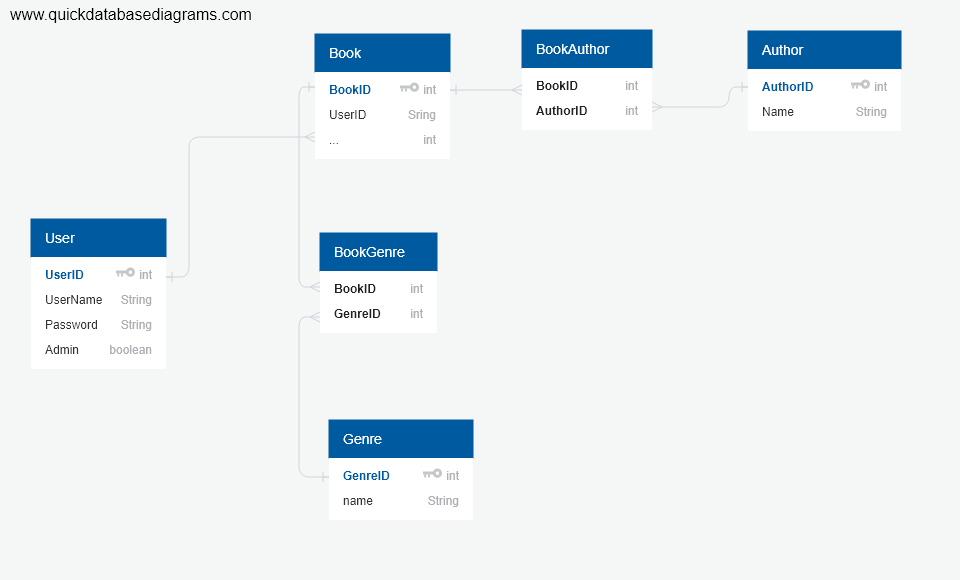

Aiheen kuvaus

Luodaan sovellus jonka avulla käyttäjä voi pitää kirjaa lukemistaan kirjoista ja niistä kirjoista jotka haluaa lukea.
Kirjat voi jakaa kategorioihin niiden genren sekä kirjasarjan perusteella. Oletuksena jokainen käyttäjä voi nähdä vain oman listansa.

Toimintoja:
  - Kirjautuminen
  - Genren lisääminen/tarkasteleminen/poisto
  - Kirjasarjan lisääminen/tarkasteleminen/poisto
  - Kirjojen lisääminen/tarkasteleminen/poisto
    - Kirjojen tarkasteleminen eri kriiterien perusteella kuten genre tai luettu/lukematta
  - Jos aikaa jää niin useampien listojen tekeminen, joita voisi myös jakaa

  Heroku: [kirjakanta.herokuapp.com]

  User Story:
  - Käyttäjänä voin lisätä kirjoja listaani
  - Käyttäjänä voin lisätä genrejä sekä kirjasarjoja "alaotsikoiksi" helpottamaan lajittelua
  - käyttäjänä voin listata kirjoja genren tai kirjasarjan perusteella
  - käyttäjänä voin merkitä lukemani kirjat luetuiksi
  - käyttäjänä voin määrittää onko listani julkinen vai ei
  - käyttäjänä voin selata muiden käyttäjien julkisia listoja

  - ylläpitäjänä voin tarkastella käyttäjiä sekä heidän lisäämiään kirjojaan ja genrejä

  Tietokantakaavio:
  
